# Buttons

There are twelve variants of buttons based on the colors used in this template with an option to change the color of the button just by replacing`btn-primary`with`btn-default btn-info btn-success btn-warning btn-danger`in the code below.

**1\) Radiused Buttons:**

we can change effect of any button by replacing`hvr-buzz`with the effect we would like `hvr-hang hvr-sink hvr-pop`and other in the code below.

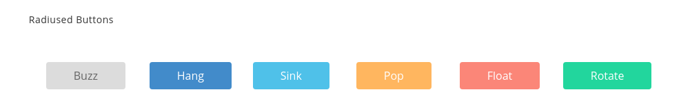

It has the following Structure:

```text
<button class="button button-rounded button-flat hvr-buzz">Button</button>
```

**2\) Rounded Buttons:**

we can change effect of any button by replacing`hvr-shrink`with the effect we want like`hvr-pulse hvr-grow hvr-push`and other in the code below.

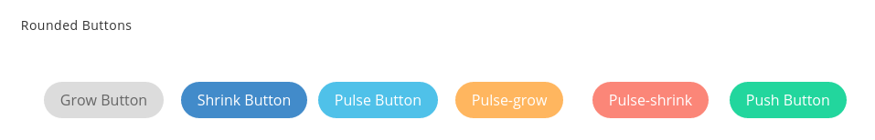

It has the following Structure:

```text
<button class="button button-pill button-primary-flat hvr-shrink">shrink</button>
```

**3\) Rectangle Buttons:**

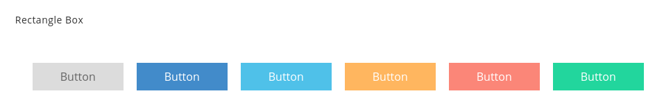

It has the following Structure:

```text
<button class="button button-primary-flat hvr-wobble-bottom">Button</button>
```

**4\) Circle Buttons:**

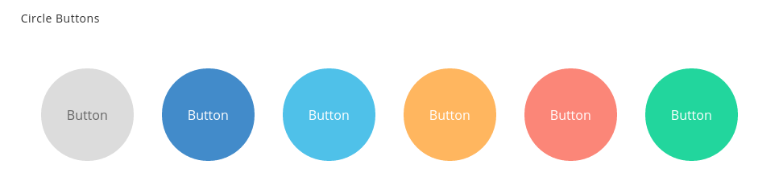

It has the following Structure:

```text
<button class="button button-circle button-primary-flat hvr-skew">Button</button>
```

**5\) Shadow and Glow Transitions Buttons:**

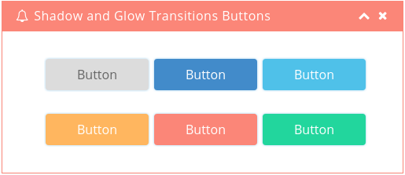

It has the following Structure:

```text
<button class="button button-glow button-rounded button-flat hvr-float-shadow">Button</button>
```

**6\) Quick Shortcuts:**

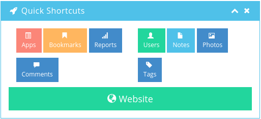

It has the following Structure:

```text
<div class="btn btn-danger btn-sm btn-responsive"  role="button">
     <span class="glyphicon glyphicon-list-alt">Apps</span>
</div>
```

**7\) 3-D Buttons:**

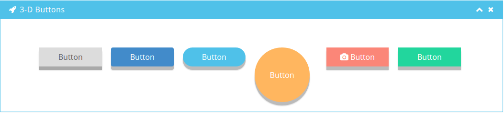

It has the following Structure:

```text
<button class="button button-3d">Button</button>
```

**8\) Spinner Buttons:**

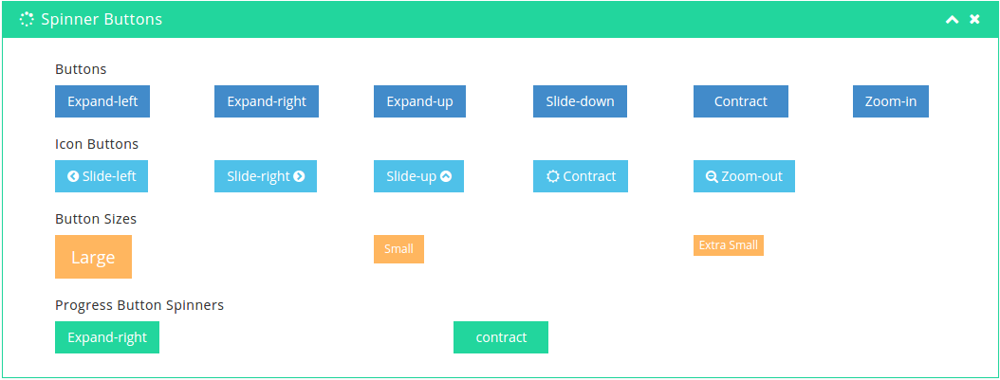

It has the following Structure:

```text
<button class="ladda-button btn btn-primary button_normal"  data-style="expand-left">
     <span class="ladda-label">Expand Left</span>
     <span class="ladda-spinner"></span>
</button>
```

**9\) Icon Button & Dropdown:**

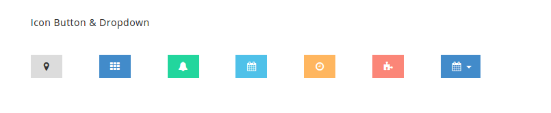

It has the following Structure:

```text
<button type="button" class="btn btn-icon btn-default m-r-50">
     <i class="icon fa fa-fw fa-map-marker" aria-hidden="true"></i>
</button>
```

**10\) Button Animation:**

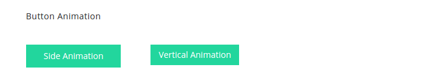

It has the following Structure:

```text
<button type="button" class="btn btn-animate btn-animate-side btn-success m-r-50">
    <span>
        <i class="icon fa fa-fw fa-map-marker" aria-hidden="true"></i>Side Animation
    </span>
</button>
```

**11\) Group Buttons:**

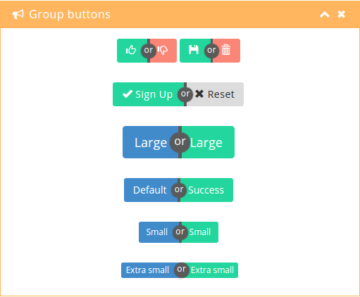

It has the following Structure:

```text
<div class="ui-group-buttons">
   <a href="#" class="btn btn-success" role="button">
      <span class="glyphicon glyphicon-thumbs-up">........</span>
   </a>
   ...
   ...
</div>
```

**12\) Buttons With Labels:**

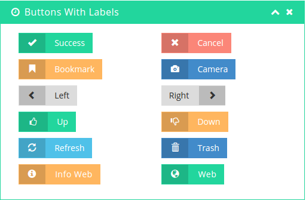

It has the following Structure:

```text
<button type="button" class="btn btn-labeled btn-success">
    <span class="btn-label">
        <i class="glyphicon glyphicon-ok" aria-hidden="true"></i>Success
    </span>
</button>
```

