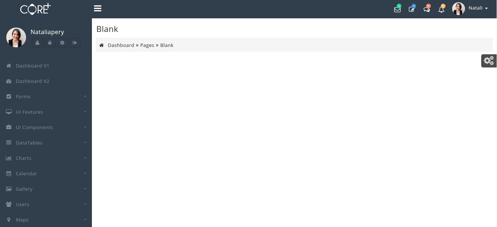

# Start New Page

The design for Blank Page is shown below:



It has the following Structure:

```text
<body class="skin-coreplus">
     <div class="preloader">
     ...
    </div>
    <header class="header">
     ....
     ....
    </header>
     ...
     ...
</body>
```

