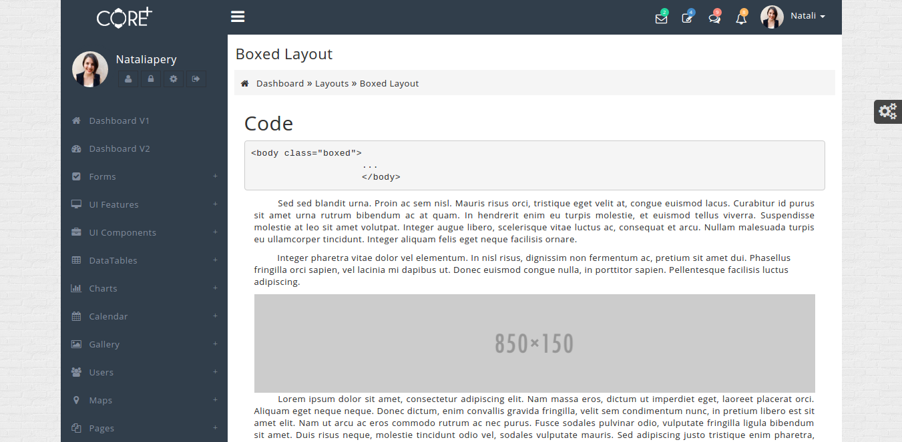

# Boxed Layout

The design for Boxed Layout is shown below:



It has the following Structure:

_structure:_

For this we need to add a class**`boxed`**in the body tag

```text
<body class="skin-coreplus boxed">
     <div class="preloader">
          ...
          ...
    </div>
    <header class="header">
         <nav class="navbar navbar-static-top" role="navigation">
            ...
         </nav>
    </header>
    <div class="wrapper row-offcanvas row-offcanvas-left">
    <aside class="left-side sidebar-offcanvas">
       ...
       ...
    </aside>
      ...
      ...
</body>
```

