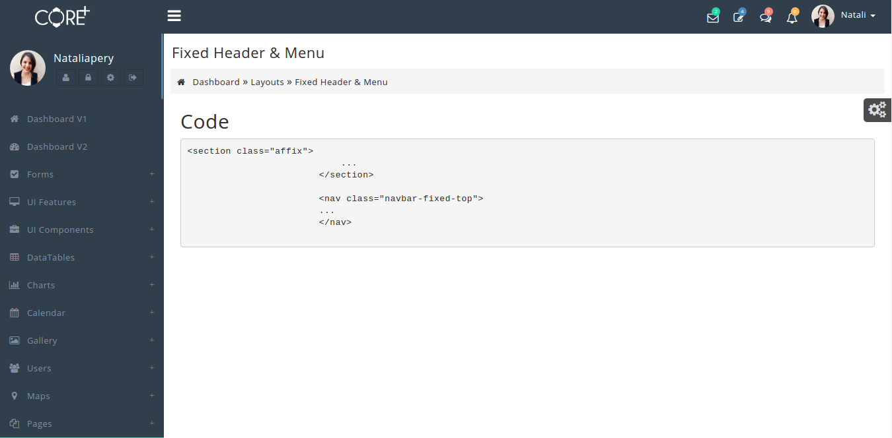

# Fixed Header and Menu

The design for Fixed Header and Menu is shown below:



It has the following Structure:

_structure:_

For this we need to add a class**`affix`**in section of aside left tag**`navbar-fixed-top`**in the nav tag.

```text
<body class="skin-coreplus">
     <div class="preloader boxed">
          ...
          ...
    </div>
    <header class="header">
         <nav class="navbar navbar-fixed-top" role="navigation">
            ...
         </nav>
    </header>
    <div class="wrapper row-offcanvas row-offcanvas-left">
    <aside class="left-side sidebar-offcanvas">
    <section class="sidebar affix">
      ...
     </section>
       ...
       ...
    </aside>
      ...
      ...
</body>
```

